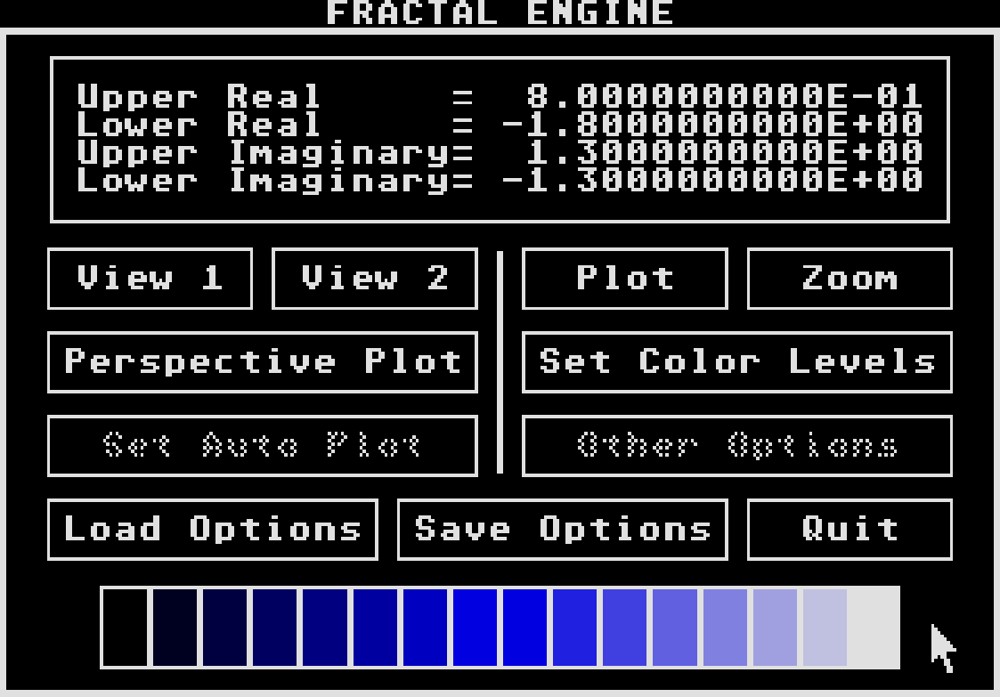

## A fractal generation program for the Atari ST

This is a fractal generation program I wrote when I was probably 15 or 16 (the late 1980s).
It was written in [Personal Pascal](http://www.atarimania.com/utility-atari-st-personal-pascal_23202.html) by [OSS](https://en.wikipedia.org/wiki/Optimized_Systems_Software) for the Atari ST line of computers.
I remember taking a lot of inspiration from [Degas Elite](https://sites.google.com/site/stessential/drawing-tools/degas-elite) for the UI.
Otherwise, the code is pretty naive and slow (not nearly as bad as the ray tracer I wrote around the same time, ugh).
The code still compiles and runs in emulators but there seem to be a few bugs here and there.

`AUXSUBS.PAS` and `GEMSUBS.PAS` from Personal Pascal have been included here for completeness.  The files don't have any licensing information and I tried to track down potential owners but OSS is long gone and Bill Wilkinson has unfortunately passed away.  I'm assuming these are safe to include here but will remove if proven otherwise.

An example plot:

The user interface:
